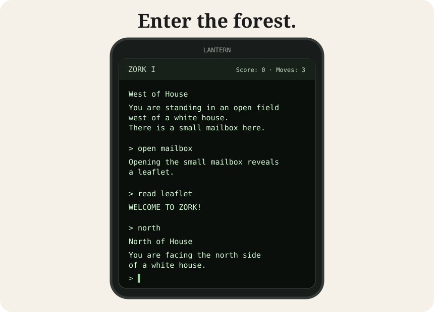

# Lantern

**Play classic text adventures in your browser.** Lantern is a playable Z-machine game interface, beginning with Zork I, with optional self-hosting and experiments in portable saves and player-held signatures.

<p align="center">
  <a href="https://johnrigler.github.io/lantern/"></a>
</p>

<p align="center">
  <a href="https://johnrigler.github.io/lantern/lantern.html"><strong>▶ PLAY LANTERN NOW</strong></a>
  &nbsp; · &nbsp;
  <a href="https://johnrigler.github.io/lantern/">Watch the animated preview</a>
</p>

The preview above shows the game interface. The [GitHub Pages homepage](https://johnrigler.github.io/lantern/) animates commands and responses, then loops. **The Play link opens the real interactive client**, which connects to the default Lantern game server at `https://rigler.org/lantern/`. Availability depends on that server being online and having the game files installed.

## How it works

Choose a game, enter commands such as `north`, `open mailbox`, or `inventory`, and read what happens. The browser is a thin client; a Python server runs `dfrotz` with a compatible Z-machine story file. Save and load controls are available in the interface.

You can change the game server under **Settings**, including using your own server instead of `rigler.org`.

```text
Browser (GitHub Pages, IPFS, or local hosting)
    ↓ HTTP API
Lantern Python server
    ↓
dfrotz + your Z-machine story files
```

## The larger world behind Lantern

**Lantern is a doorway, not the destination.** Zorkmid is proposed as an entry currency and a familiar tokenomics interface to a much larger world built with [Chisel](https://github.com/johnrigler/chisel). The distinguishing advantage is not a promise that game activity will drive a token price. It is years of working with public ledger data, encodings, addresses, transaction construction, self-sovereign signing, and replaceable web infrastructure. Chisel makes those capabilities available as interoperable tools, not as a proprietary platform.

The possible digital social experience extends beyond a game, a token, or a single website: people can publish signed messages, record game outcomes, follow artifact histories, respond to one another, attach IPFS documents, and decide which issuers, communities, or rules they trust. Hosts and interfaces can be replaced. Many interactions need no Zorkmid at all.

One proposed example is **historical token-gated participation**. A participant signs an action when their address holds the required token balance. A verifier checks ownership at a specified block or transaction state and records an independently verifiable claim or receipt. The participant might later sell every token. That does not erase the historical eligibility of the earlier action. Other people can respond to the resulting record without themselves holding tokens, depending on the community's rules. This requires explicit chain-state proofs or reproducible state queries, signed authorship, and recorded verification context; a wallet balance inspected today does not establish a historical fact by itself.

This is the proposed **unfair advantage** relative to an ordinary token launch: an independently useful, extensible ecosystem is already under development, and token ownership is merely one possible input to its rules. [The Zorkmid white paper](ZORKMID-WHITEPAPER.md) describes the broader model and separates existing functionality from future integrations.

## Why the story matters

The [Zorkmid monetary white paper](ZORKMID-WHITEPAPER.md#i-b-the-proof-is-the-story-bridging-two-audiences) explains the proposed bridge between conventional investors and crypto users: a story makes an unfamiliar protocol accessible, but each claimed utility must end in an independently reproducible action, signature, transaction, or indexed record. The point is to **show what the token and surrounding infrastructure can do**, not to imply that demonstration guarantees token appreciation.

## Run your own server

Lantern is not dependent on the default host. On a Linux machine, install Python and Frotz, provide compatible story files, and run the server:

```sh
sudo apt install frotz
python3 lantern.py
```

By default the server listens on port `7788`. For a remotely hosted HTTPS client, expose the API behind an HTTPS reverse proxy. The client can then use your server URL in **Settings**.

For details, see [Lantern setup and API notes](LANTERN.md), the [self-hosting section](https://johnrigler.github.io/lantern/#self-hosting), and [About Lantern](about.html).

## Background and experiments

Lantern began as **Zarkmid**, a project named for the fictional currency in Infocom's Zork games. Earlier experiments explored referencing game saves from Dogecoin transactions. The current implementation uses Python and Frotz, and explores user-held cryptographic identities, portable game saves, and optional payments for independently operated hosting.

The game files are separate from the client and server code. Only distribute story files you have rights to use. For Frotz, see [the Frotz project](https://gitlab.com/DavidGriffith/frotz); for historical Infocom downloads, see [infocom-if.org](https://infocom-if.org/downloads/downloads.html).

**Zorkmid:** [Read the in-world monetary white paper](ZORKMID-WHITEPAPER.md). This is a proposed currency and financing design, not a deployed token or investment offering.

**Links:** [Play the game](https://johnrigler.github.io/lantern/lantern.html) · [Lantern homepage](https://johnrigler.github.io/lantern/) · [Technical notes](LANTERN.md) · [Attestation proposal](ATTESTATION-PROPOSAL.md)
